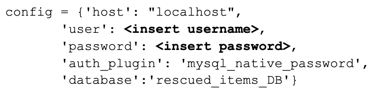

## INSTRUCTIONS

1. create and activate virtual environment (.venv)

2. install requirements by running `pip install -r requirements`

3. run *rescued_items_db_forAPI.sql* script in MySQL Workbench to initialise database

4. create and **update** *config.py* with required database creadentials: 

5. in a separate terminal, activate .venv and run `uvicorn app:app --reload` to start FastAPI server 

6. run *main.py* to preview result of each request type